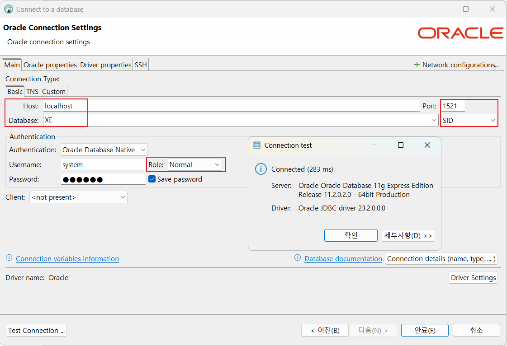

# java-database-2025
PK_Java 개발 과정

## 1일차
- Github Desktop 설치
    - Git 명령어 없이 사용 가능

- Database(DB) 개요
    - 데이터를 저장 및 관리
    - 데이터베이스를 관리
    - 가장 유명한 것이 Oracle
    - 사용자는 SQL로 요청

- Oracle 설치(Docker)
    1. Powershell 오픈
    2. pull 내려받기
        ```shell
        > docker pull oracleinanutshell/oracle-xe-11g
        ```
    3. 다운로드 이미지 확인
        ```shell
        PS C:\Users\jszxr> docker image ls
        ```
    4. 도커 컨테이너 실행
        ```shell
        > docker run --name oracle11g -d -p 1521:1521 --restart=always oracleinanutshell/oracle-xe-11g
        ```
        - 1522: Oracle 기본 port(항구)
    5. 도커 실행 확인
        - Docker Desktop > Containers 확인
    6. Powershell 오픈
        ```shell
        > docker exec -it oracle19c bash
        [oracle@94b01e97c7c1 ~]$ sqlplus / as sysdba

        SQL > 
        ```
    7. DBeaver 접속
        - Connection > Select your DB > Oracle 선택

        

-DBeaver 툴 설치

- DML, DDL, DCL
    - 언어의 특징을 가지고 있음
    - SQL - 무엇(What)
        - 프로그래밍 언어와 차이 - 어떻게(How)
    - SQL의 구성요소 3가지
        1. DDL(Data Definition Lang)
            - 데이터베이스 생성, 테이블 생성, 객체 생성, 수정, 삭제
                - CREATE, ALTER, DROP...
        2. DCL(Data Control Lang)
            - 사용자 권한 부여, 해제, 트랜잭션 시작, 종료
                - GRANT, REVOKE, BEGIN TRANS, COMMIT, ROLLBACK
        3. DML(Data Manupulation Lang) 
            - 데이터 조작 언어(핵심), 데이터 삽입, 조회, 수정, 삭제
                - INSERT, SELECT, UPDATE, DELETE


- SELECT 기본
    - 데이터 조회 시 사용하는 기본명령어
    ```sql
    -- 기본 주석(한 줄)
    /*
        여러줄 주석
    */
    SELECT [ALL|DISTINCT][*|컬럼명(들)]
        FROM 테이블명(들)
    [WHERE 검색조건(들)]
    [GROUP BY 속성명(들)]
    [HAVING 집계함수조건(들)]
    [ORDER BY 정렬속성(들) ASC|DESC]
    [WITH ROLLUP]
    ```
    - 기본 쿼리 학습: [SQL](./day01/sql01_select기본.sql)
        1. 기본 SELECT
        2. WHERE 조건절
        3. NULL(!)
        4. ORDER BY 정렬
        5. 집합

- 함수(내장함수)
    - 문자함수: [SQL](./day01/sql02_함수.sql)

## 2일차

- 함수(계속)
    - 문자함수부터:
    - 숫자함수
    - 날짜함수
    - 형변환함수

- 데이터베이스 타입형
    - **CHAR(n)** - 고정형 문자열, 최대 2000바이트
        - 'Hello World', 공백 포함
    - **VARCHAR(n)** - 가변형 문자열, 최대 4000qkdlxm
        - 'Hello World'
    - INTEGER - 모든 데이터의 기준. 4byte, 정수를 담는 데이터형
    - FLOAT(p) - 실수형 타입, 최대 22byte
    - NUMBER(p, s) - 숫자값, p 전체 자리수, s 소수점 길이. 최대 22byte
    - Date - 날짜 타입
    - LONG(n) - 가변 길이 문자열, 최대 2G바이트
    - LONG(n) - 원시 이진 데이터, 최대 2G바이트
    - CLOB - 대용량 텍스트 데이터 타입, 최대 4G
    - BLOB - 대용량 바이너리 데이터 타입, 최대 4G
    - BFILE - 외부 파일에 저장된 데이터

## 3일차
- JOIN
    - ERD(Entity Relationship Diagram): 개체 관계 다이어그램
        - PK(Primary Key): 기본키, 중복 X UNIQUE NOT NULL
        - FK(Foreign Key): 외래키, 다른 엔티티의 PK(관계 연결)
        - Relationship: 부모 엔티티와 자식 엔티티 간의 연관, 부모 1은 자식 n을 가질 수 있음
    - 카티션곱
    - 내부조인
    - 외부조인
- DDL
    - CREATE - TABLE, VIEW, PROCEDURE, FUNCTION
        ```sql
        CREATE TABLE 테이블명(
            첫번째_컬럼  타입형  제약조건,
            두번째_컬럼  타입형  제약조건,
            ...
            마지막_컬럼  타입형  제약조건
            [,
            기본키, 외래키 등의의 옵션
            ]
        );

        ```

## 5일차
- VIEW
    - 기존 테이블에서 권한 별로 보일 수 있는 컬럼을 지정해서 만드는 개체
    - 기존 테이블 중 개인정보나 중요한 부분이 있으면 제외하고 보일 수 있음
    - 뷰라도 INSERT, UPDATE, DELETE가 가능함. 단일 뷰에서만
        ```sql
        CREATE VIEW 뷰명
        AS
            SELECT 쿼리;
        [WITH READ ONLY]
        ```
    - 복합 뷰는 두 개 이상의 테이블을 조인해서 만든 뷰

- 서브쿼리
    - 메인 쿼리를 도와주는 하위 쿼리를 뜻함. 소괄호 내에 포함됨
    - 단일행 서브쿼리, 다중행 서브쿼리마다 사용법 다름
    - SELECT절 서브쿼리, FROM절 서브쿼리, WHERE절 서브쿼리
    - 서브쿼리는 JOIN으로 거의 다 변경 가능

- 시퀀스
    - 번호로 지정된 PK 값을 자동으로 삽입할 수 있도록 도와주는 기능
    - 없어도 기능에는 차이가 없지만 효율을 위해서 가용
        ```sql
        CREATE SEQUENCE 시퀀스명
        INCREMENT BY 1 -- 증가값
        START WITH 1 -- 초기 시작값
        [MAXVALUE 999999] -- 최대 증가값
        [CYCLE] -- 최대 증가값에 도달하면 다시 처음 1로 돌아갈 것인지
        [CACHE] -- 번호 증가 캐쉬(대용량 삽입시만 관계)
        
        시퀀스명.NEXTVAL
        시퀀스명.CURRVAL
        ```

- 사용자 계정 권한: [쿼리](./day05/sql04_사용자계정관리.sql)
    - 사용자 생성 후 권한(롤)을 부여해야 스키마를 사용 가능

    ```sql
    -- 권한 부여
    GRANT 권한|롤 TO 사용자 [WITH ADMIN|GRANT OPTION];
    -- 권한 해제
    REVOKE 권한|롤 FROM 사용자;
    ```

## 6일차
- PL/SQL - ORACLE에서 파이썬처럼 코딩
    - 오라클에서 프로그래밍을 하기 위한 언어
    - 기본 구조
        - 선언부(DECLARE), 실행부(BEGIN~END), 예외처리부(EXCEPTION) 구성
    - Oracle 스키마 중 Packages, Procedures, Functions 이 PL/SQL로 작업하는 영역
        - 저장된(Stored) PL/SQL
    - 결과 화면에 출력하려면 명령어를 실행하고 PL/SQL을 수행해야 함
        ```sql
        SET SERVEROUTPUT ON; -- 화면 출력기능 활성화
        SHOW ERRORS;
        ```

- Stored Procedure와 Function를 만들기 위해서 사용
    - 한꺼번에 많은 일을 수행해야 할 때(Transaction당 수행되는 로직들 묶어서)
    - 예) 한 번에 5개의 테이블에서 조회와 DML을 처리해야 한다
        - 쿼리를 최소 10개를 수행해야 함
        - 프로시저 한 번만 수행해서 해결할 수 있음
    -- 중대형 IT솔루션에서는 프로시저가 거의 필수
    ```sql
    CREATE OR REPLACE PROCEDURE 프로시저명
    (
        param1 datatype,
        param2 datatype,
        ...
    )
    IS | AS
    PL/SQL Block;
    ```
    - 실행 시 EXEC 사용
    ```sql
    CALL 프로시저명(파라미터);
    EXEC 프로시저명(파라미터); -- DBeaver에서 사용불가
    ```
- 함수
    - 스칼라값을 리턴할 때 - Select절 서브쿼리와 기능이 동일
    - 개발자에게 편의성을 제공하기 위해서 만듦
    ```sql
    CREATE OR REPLACE FUNCTION 함수명
    (
        param1 datatype,
        ...
    )
    RETURN datatype
    IS | AS
    PL/SQL Block;
    /
    ```
    - 실행시 select문 등 DML문과 같이 사용
    ```sql
    SELECT 
    ```


