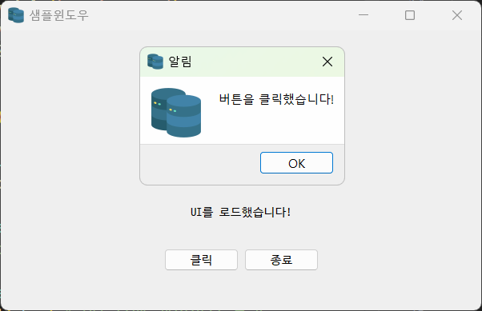

## 토이 프로젝트
Python GUI - Oracle 연동 프로그램램

### GUI 프레임워크 
- GUI 프레임워크 종류
    1. tkinter 
        - 파이썬 내장된 GUI 라이브러리. 중소형 프로그램 사용. 간단하게 사용 가능. 안 이쁨.
    2. PyQt / PySide 
        - C/C++에서 사용하는 GUI 프레임워크 Qt를 파이썬에 사용하게 만든 라이브러리. 현재 6버전 출시. 유료.
        - PyQt의 사용 라이선스 문제로 PySide 릴리즈. PyQt에서 Pyside 변경하는데 불편.
        - tkinter보다 난이도가 있음.
        - 예쁨. QtDesigner 툴로 포토샵처럼 GUI를 디자인 가능.
        - Python GUI 중에서 가장 많이 사용 중.
    3. Kivy
        - OpenGL(게임 엔진용 3D 그래픽 엔진)으로 구현되는 GUI 프레임워크.
        - 안드로이드, IOS 등 모바일 용으로도 개발 가능.
        - 최근에 나온 기술이라 아직 불안정.
    4. wxPython
        - Kivy처럼 멀티 플랫폼 GUI 프레임워크.
        - 어려움.

### PyQt5 GUI 사용
- PyQt5 설치
    - 콘솔 pip install PyQt5

- QtDesigner 설치
    - https://build-system.fman.io/qt-designer-download 다운로드 후 설치

#### PyQt5 개발
1. PyQt 모듈 사용 윈앱 만들기
2. 윈도우 기본 설정
3. PyQt 위젯 사용법(레이블, 버튼)
4. 시그널(이벤트) 처리방법
5. QtDesigner로 화면 디자인, PyQt와 연동

#### Oracle 연동 GUI 개발 시작
- 오라클 Python 연동 DB(스키마) 생성
- Student 테이블 생성, 더미데이터 추가
- Python 오라클 연동 테스트
- QtDesigner로 화면 구성
- PyQt로 Oracle 연동 CRUD 구현현